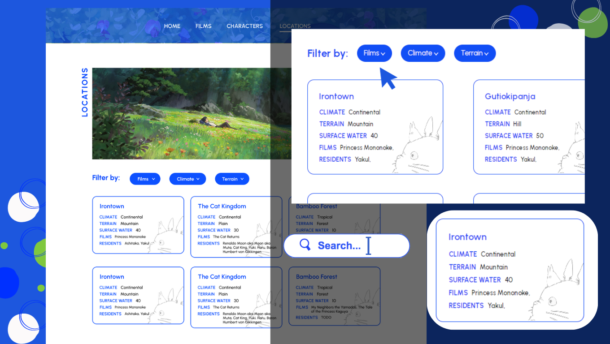

<h1 align="center">Ghibli Films</h1>

<div align="center">
   A web page where you can found the best of Studio Ghibli films.
</div>

## Table of contents
- [Getting Started](#getting-started)
  - [Built with](#built-with)
  - [Installation](#installation)
- [Overview](#overview)
  - [Screenshot](#screenshot)
  - [Links](#links)
- [How to use](#how-to-use)
  - [Films](#films)
  - [Film](#film)
  - [Characters](#characters)
  - [Locations](#locations)
- [Contact](#contact)

## Getting Started
### Built with


- JavaScript
- React
- CSS
- [Studio Ghibli API](https://ghibliapi.vercel.app)

### Installation
Run the following commands:
```
npm install
```
Running the app
```
npm start
```
To view it open http://localhost:5173

## Overview
### Screenshot


### Links
- Live Site URL: [Ghibli Films](https://ghibli-films-fg.vercel.app)
- Code in Github: [https://github.com/FatimaGR/Ghibli-films](https://github.com/FatimaGR/Ghibli-films)

## How to use
### Films
You will find all the movies from Studio Ghibli here, and you can filter them by location, release date or director. You can also search them by name.

To read more about a film, you can click the film name.


### Film
Here you will find information about a film.
- Names
- Description
- Duration, release date and score
- Director and producer
- Characters and locations


### Characters
You will find all the characters here, and you can filter them by film, gender or specie. You can also search them by name.


### Locations
You will find all the locations here, and you can filter them by film, gender or specie. You can also search them by name.



## Contact
- Website - [Fatima Gallardo](https://porfolio-website-gules.vercel.app)
- GitHub - [@FatimaGR](https://github.com/FatimaGR)